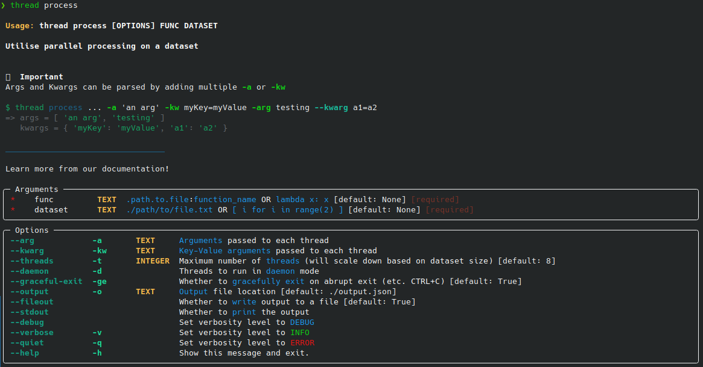

# CLI Documentation

I will lay out how to use the comamnd line!

<br />
<details>
  <summary>Jump to</summary>
  <ul>
    <li><a href='#importing-the-class'> Import the class</a></li>
    <li><a href='#initializing-a-thread'> Initialize a thread </a></li>
    <li><a href='#parameters'> Parameters </a></li>
    <li><a href='#attributes'> Attributes </a></li>
    <li><a href='#methods'> Class Methods </a></li>
    <li><a href='#behviours'> Behaviours </a></li>
  </ul>
</details>


Don't have the thread library? [See here](./getting-started.md) for installing thread

---

## Getting started

Try running the help command!
```sh
$ thread -h/--help
```


<br />


## Log levels

Thread CLI uses the [python logging library.](https://docs.python.org/3/library/logging.html)

--------------
|   Name   | Level |
| :-----:  | :---: |
|   NOTSET | 0     |
|    DEBUG | 10    |
|     INFO | 20    |
|     WARN | 30    |
|    ERROR | 40    |
| CRITICAL | 50    |

<br />


## Commands

List of commands

<br />


### Documentation (thread docs)

Ran with no arguments and options, this command will attempt to open your brower to this MD file!
<br />
If unable, will instead print out the link.

<br />


### Help (thread help)

Ran with no arguments and options, this command will attempt to open your brower to the issue tracker!
<br />
If unable, will instead print out the link.

<br />


### Report (thread report)

Ran with no arguments and options, this command will attempt to open your brower to this MD file!
<br />
If unable, will instead print out the link.

<br />


### Configuration (thread config ...)

Comming soon.


<br />


### Parallel Processing (thread process ...)

Invokes the [parallel processing class](parallel-processing.md#importing-the-class)<br />

> **Help Command Output**



> **Example Usage**
```sh
$ thread process 'lambda x: x**2' '[ i for i in range(1000) ]'
=> Writes to "output.json" every number from 0 to 1000 squared.

$ thread process home.Downloads.clean_data:clean ./dataset.csv -t 20
=> The same as:
  from home.Downloads.clean_data import clean
  dataset = open('dataset.csv', 'r')

  newProcess = ParallelProcess(
    target = clean,
    dataset = dataset,
    max_threads = 20
  )
  newProcess.start()

  prints or writes to file the result
```

<br />


Now you know how to use the [`Thread CLI`](#cli-documentation)!

[See here](./parallel-processing.md) for how to using the `thread.ParallelProcessing` class!
